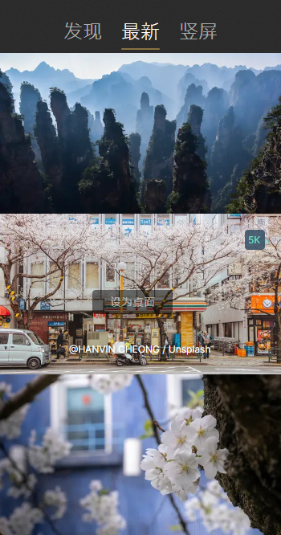
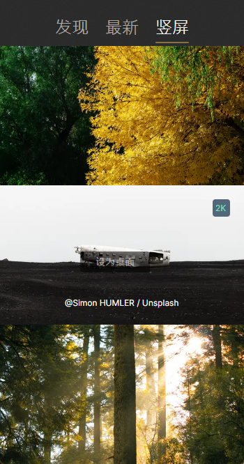

# Pap.erNet
参考MacOS上面的[pap.er](https://paper.photos)，采用[Avalonia](https://github.com/AvaloniaUI/Avalonia)跨平台技术实现的Windows /Liunx 下的壁纸软件。

## 开发
```bash
git clone https://github.com/ae6623/Pap.erNet.git
cd Pap.erNet/
# 架构名称的选择性：x64 / x86 / arm64，注意：请在相关的操作系统下编译，不能跨平台编译
./build-win.bat 架构名称 或者 ./build-linux.sh 架构名称 或者  ./build-mac.sh 架构名称
最好是让ai去开发，防止自己开发出错
```

## 文档
#### 发现


#### 最新


#### 竖屏


#### 我的壁纸

#### 设置-自动切换壁纸


## 更新日志
> v0.0.1
- 基础壁纸功能

## 其它
切勿用于商业用途，仅作学习使用，最好是让AI去二次开发

## 感谢项目/产品

- [AsyncImageLoader.Avalonia](https://github.com/AvaloniaUtils/AsyncImageLoader.Avalonia)的代码参考
- [pap.er](https://paper.photos) MacOS上的最美壁纸软件

## 协议
采用GPL-3.0 license

## Star History

[](https://star-history.com/#Pap.erNet/Pap.erNet&Date)

## 免责声明
代码仅供交流学习使用，请勿用于非法用途和商业用途！如因此产生任何法律纠纷，均与作者无关！
